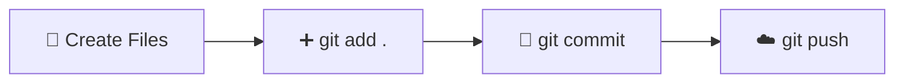

<div align="center">

# 🚀 Git & GitHub Setup Guide

### 📖 Complete Beginner Guide for Windows


</div>

---

# 📥 Step 1 — Install Git

Download Git for Windows.

🔗 https://git-scm.com/install/windows

---

# ⚙️ Step 2 — Configure Git

Open **Git Bash** and remove any previous Git configuration.

```bash
git config --global --unset user.name
git config --global --unset user.email
```

Now add your GitHub account.

```bash
git config --global user.name "rushikesh1278"
git config --global user.email "valarushikesh1278@gmail.com"
```

---

# ✅ Step 3 — Verify Configuration

```bash
git config --list
```

Expected output

```text
user.name=rushikesh1278
user.email=valarushikesh1278@gmail.com
```

---

# 📁 Step 4 — Create Your Project

Example

```
news-website
```

Open the folder in **Visual Studio Code**.

---

# 🚀 Step 5 — Initialize Git

```bash
git init
```

---

# 🌐 Step 6 — Create GitHub Repository

✔ Login to GitHub

✔ Click **New Repository**

✔ Enter repository name

Example

```
news-website
```

✔ Click **Create Repository**

---

# 🔗 Step 7 — Connect GitHub Repository

Copy the command from GitHub.

```bash
git remote add origin https://github.com/USERNAME/REPOSITORY.git
```

Paste it into your terminal.

---

# 📄 Step 8 — Create Your Files

Example

```
index.html
style.css
script.js
README.md
```

---

# ➕ Step 9 — Add Files

```bash
git add .
```

> 💡 Don't forget the space before the dot.

---

# 💾 Step 10 — Commit

```bash
git commit -m "Initial commit"
```

Example

```bash
git commit -m "Created homepage"
```

---

# 🌿 Step 11 — Check Branch

```bash
git branch
```

Output

```text
* main
```

or

```text
* master
```

---

# ☁️ Step 12 — Push to GitHub

For **main**

```bash
git push -u origin main
```

For **master**

```bash
git push -u origin master
```

After first push

```bash
git push
```

---

# 🔄 Daily Workflow

```text
✏️ Edit Files
      │
      ▼
➕ git add .
      │
      ▼
💾 git commit -m "Message"
      │
      ▼
☁️ git push
```

---

# 📚 Common Git Commands

| Command | Description |
|----------|-------------|
| `git --version` | Check Git Version |
| `git status` | Repository Status |
| `git branch` | Current Branch |
| `git log` | Commit History |
| `git config --list` | Git Configuration |
| `git pull` | Download Latest Changes |
| `git push` | Upload Changes |
| `git clone URL` | Clone Repository |

---

# 🎯 Basic Git Workflow



---

# 📂 Project Structure

```
news-website/
│
├── index.html
├── style.css
├── script.js
├── assets/
│   ├── images/
│   └── icons/
│
└── README.md
```

---

# 💡 Best Practices

✅ Commit frequently

✅ Use meaningful commit messages

✅ Check `git status`

✅ Push regularly

✅ Keep project organized

❌ Never upload passwords

❌ Never upload API keys

---

<div align="center">

# 👨‍💻 Author

### Rushikesh

📧 **valarushikesh1278@gmail.com**

🐙 **GitHub:** rushikesh1278

⭐ Happy Coding!

</div>
